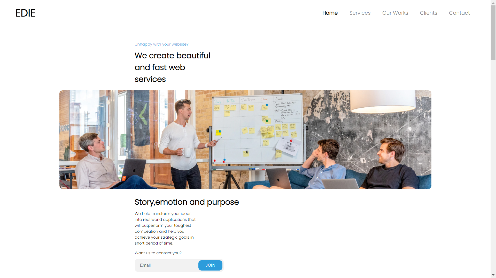

<!-- Please update value in the {}  -->

<h1 align="center">Edie Web Services</h1>

<div align="center">
   Solution for a challenge from  <a href="http://devchallenges.io" target="_blank">Devchallenges.io</a>.
</div>

<div align="center">
  <h3>
    <a href="https://edie-web-services.vercel.app/">
      Demo
    </a>
    <span> | </span>
    <a href="https://github.com/AmanDeep9925/Edie-Web-Services">
      Solution
    </a>
    <span> | </span>
    <a href="https://devchallenges.io/challenges/xobQBuf8zWWmiYMIAZe0">
      Challenge
    </a>
  </h3>
</div>

<!-- TABLE OF CONTENTS -->

## Table of Contents

-   [Overview](#overview)
-   [Built With](#built-with)
-   [Features](#features)
-   [How to use](#how-to-use)
-   [Acknowledgements](#acknowledgements)

<!-- OVERVIEW -->

## Overview



### Built With

-   HTML
-   CSS
-   JS

## Features

<!-- List the features of your application or follow the template. Don't share the figma file here :) -->

This is a static design with fully responsive design.

## How To Use

<!-- Example: -->

To clone and run this application, you'll need [Git](https://git-scm.com) and [Node.js](https://nodejs.org/en/download/) (which comes with [npm](http://npmjs.com)) installed on your computer. From your command line:

```bash
# Clone this repository
$ git clone https://github.com/AmanDeep9925/Edie-Web-Services

```

## Contact

-   GitHub [AmanDeep9925](https://github.com/AmanDeep9925)
